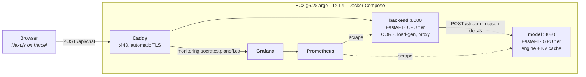
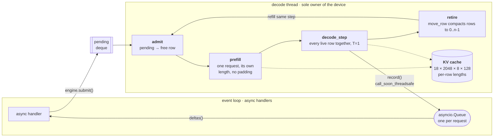

# socrates

An LLM inference engine written from scratch. `Qwen/Qwen3-4B` is implemented in
plain PyTorch, RoPE, QK-norm, 4:1 GQA, SwiGLU, KV cache, and served
through a continuous-batching scheduler behind a streaming HTTP API, deployed on
a single GPU with Terraform and instrumented end to end.

No `transformers` modelling code, no vLLM, no TGI in the serving path. vLLM runs
only as a yardstick, on the same box under the same load.

## Results

One L4 (`g6.2xlarge`, 24 GB, ~300 GB/s), Qwen3-4B in bf16, 18 rows × 2048
context, 64 prompts arriving Poisson at 2/s, seed 0.

| metric | socrates | vLLM 0.29 | share |
|---|---|---|---|
| throughput, run average | 200.4 tok/s | 289.8 tok/s | **69.2%** |
| throughput, median second | 234.0 tok/s | 312.0 tok/s | 75.0% |
| throughput, peak second | 342.0 tok/s | 450.0 tok/s | 76.0% |
| per-stream | 15.6 tok/s | 25.5 tok/s | 61.0% |
| ITL p50 | 64.2 ms | 39.2 ms | 1.6× worse |
| TTFT p95 | 30.7 s | 9.5 s | 3.2× worse |

The remaining gap is bytes, not Python: every row shares one KV window sized to
the longest live sequence, so a short row pays the long row's read. Per-row or
block-sparse reads are worth roughly another 1.2× by the bandwidth arithmetic;
the last stretch after that is kernel efficiency — ~55% of peak bandwidth
against vLLM's ~70%.

## Architecture

Two tiers, split so the GPU tier stays a stateless text-in/text-out service and
everything user-facing — auth, sessions, rate limits — lands on the CPU side
without moving with it.



Inside the GPU tier, one thread owns the device and every HTTP handler is
`async`. A handler never blocks on generation — it waits on a per-request
`asyncio.Queue` that the decode thread fills, which is what keeps `/metrics`
answerable while 18 rows are mid-generation.



A closed tab cancels the handler, which sets `cancelled` on the request; the
next sweep retires the row mid-generation rather than finishing tokens nobody
will read.

Three things in that loop are the whole project:

- **Ragged rows.** `lengths[r]` is per row, so sequences of different lengths
  share one batch with no padding. Attention masks every slot past a row's own
  position, so the unwritten tail is discarded rather than skipped — which means
  the read shape never changes and CUDA graphs can capture it.
- **Retire and refill.** A finished row is replaced from the queue on the same
  step. `move_row` compacts live rows down so the active block stays packed at
  `0..n-1` and the decode batch is always dense.
- **No host sync in the step.** Nothing reads a tensor value back to the CPU
  mid-forward; `lengths` is maintained host-side because the scheduler already
  knows it. One `int(tensor)` per layer would be 36 pipeline stalls per step.

## Stack

| | |
|---|---|
| model | PyTorch — `nn.Linear`, SDPA with `enable_gqa`, bf16, `torch.compile(mode="reduce-overhead")` on the decode path only |
| serving | Python, FastAPI — two tiers, ndjson token streaming, httpx streaming proxy |
| frontend | Next.js on Vercel, `fetch` + `ReadableStream` |
| infra | Docker, EC2, Terraform, Prometheus + Grafana |
| analysis | PyTorch profiler, DCGM — roofline arithmetic checked against every measurement |

## Layout

```
model/          GPU tier
  qwen/         the model: RMSNorm, RoPE, GQA attention, SwiGLU, KVCache
  inference_cont.py   engine — submit, admit, prefill, decode_step, retire
  inference_static.py static batching, kept as the baseline to beat
  server.py     /generate, /stream, /metrics, /health
backend/        CPU tier — /api/chat, /api/benchmark, Poisson load generator
frontend/       UI
analysis/       roofline arithmetic; layer-by-layer allclose against HuggingFace
bench/          day_2..day_5 harnesses and plots
monitoring/     Prometheus and grafana configs
infra/prod/     Terraform
caddy/          Caddyfile for socrates.pianofi.ca + monitoring.socrates.pianofi.ca
docs/           daily writeups
```

## Running it

```bash
make install                 # uv sync + npm install
make dev                     # model :8080, backend :8000, frontend :3000,
                             # prometheus :9090, grafana :3001
```

`make dev` runs the model tier on `DEVICE=mps` by default; set `DEVICE=cuda` on
a GPU host. Weights come from HuggingFace on first boot.

```bash
make images && make push
cd infra/prod && terraform apply
```
